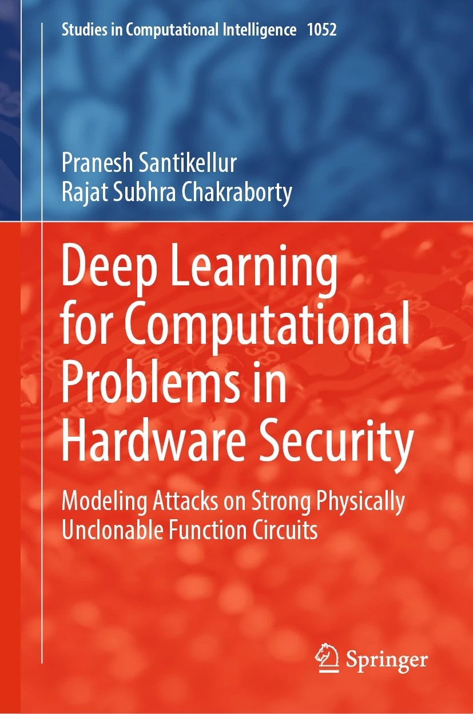

About Me
======

- I'm currently working as a Sr. Embedded Security Researcher at the Technology Innovation Institute in Abu Dhabi, United Arab Emirates.

- I earned my PhD from the Computer Science and Engineering Department at the Indian Institute of Technology (IIT) Kharagpur, India, under the guidance of Prof. Rajat Subhra Chakraborty. My doctoral thesis focused on the design and analysis of machine learning-based model building attacks on physically unclonable functions.  My PhD was funded by Intel® Corporation, USA. Additionally, I was also an Intel® AI Academy Student Ambassador for IIT Kharagpur.

- My primary areas of research interest are: Hardware Security, Embedded Systems Security and PLC Automation.

- Books: Available at this [link](https://link.springer.com/book/10.1007/978-981-19-4017-0). 
- Prior to my PhD, I had worked as a firmware engineer for nearly six years in Bangalore, India.

Invited Talks
======

* Presented as a Keynote Speaker for ISEA-Virtual Presentation Conclave conducted by IIT Guwahati on the topic "Modeling Attacks on Physically Unclonable Functions".  [Link](https://iseapmu.in/virtualconclave/ivpc2022)
* Presented a webinar for "IEEE CAD for Assurance" on our tool "Deep Feedforward Neural Network Based PUF Attack Tool”. [Link](https://ieee-ceda.org/presentation/webinar/cad-assurance-neos-toolset-and-deep-learning-based-model-building-attacks)
* Presented a webinar at IIEST Shibpur, India on the topic "Recent Advances in Machine Learning based Modeling Attacks on PUF”.
* Presented a tutorial at IEEE TENCON 2019 on "Physically Unclonable Functions: Design, Applications, Threats”.
* Presented a talk on "TinyML Demystified:  Machine learning in Embedded Systems and its Applications" at SIT, Tumkur

My Work Experience
======

* Technology Innovation Institute, Abu Dhabi, UAE (2022 - Now)
* Horner Engineering India, Bengaluru (2012-2016)
* Processor Systems, Bengaluru (2010-2012)

My Teaching Experience (as a TA)
======

* Computer Organisation and Architecture Laboratory (CS39001, CS31007), IIT Kharagpur
* Programming and Data Structures Laboratory (CS11001), IIT Kharagpur
* Machine learning (CS60050), IIT Kharagpur

