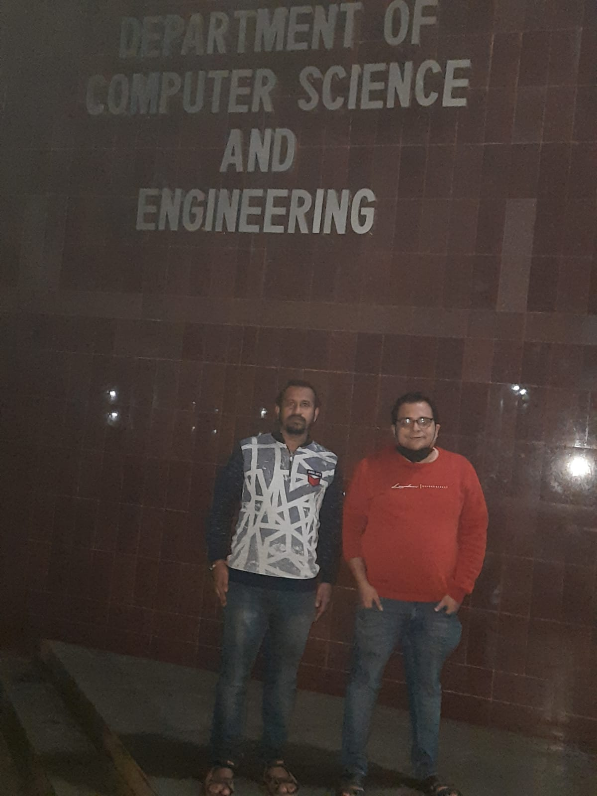
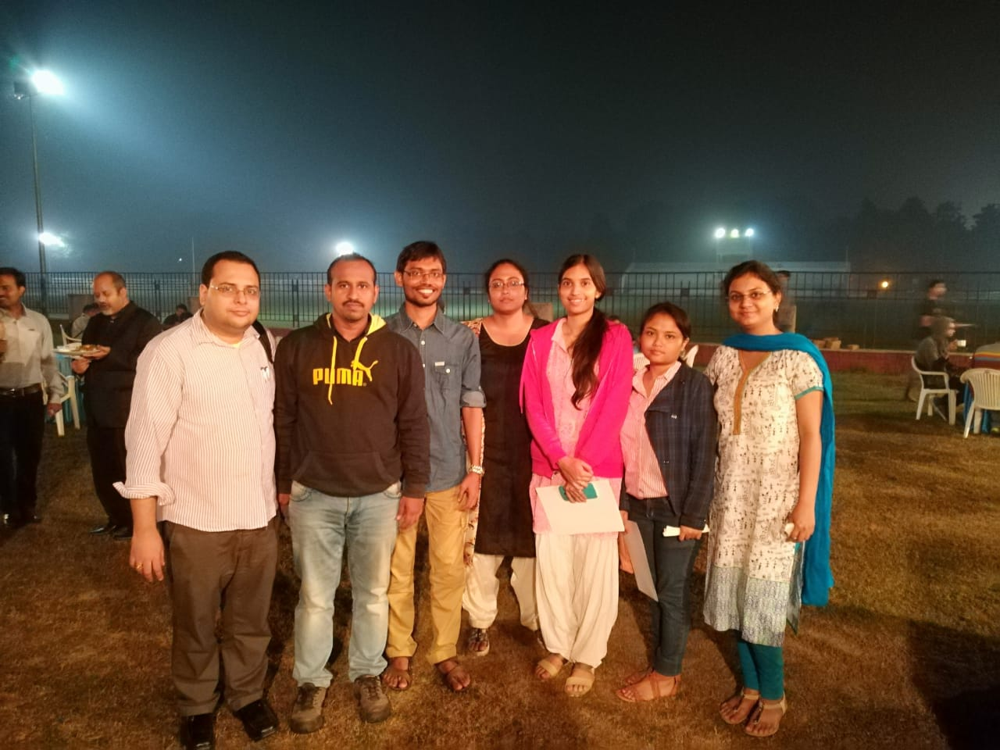
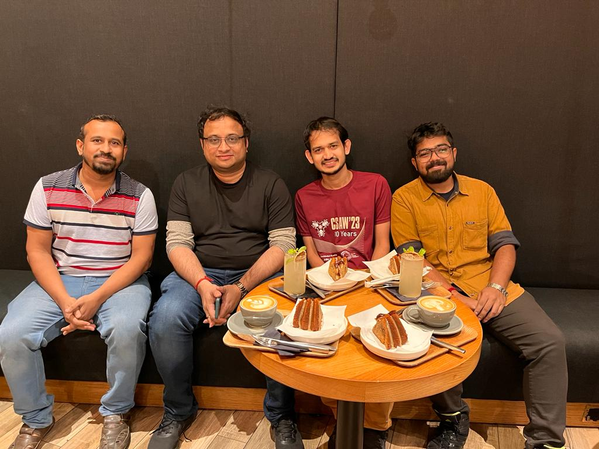
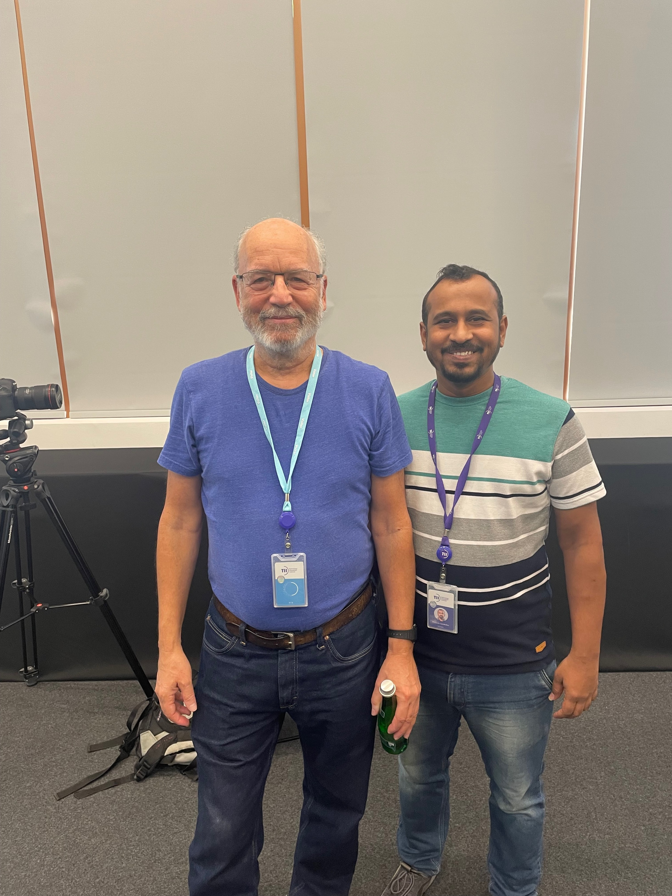
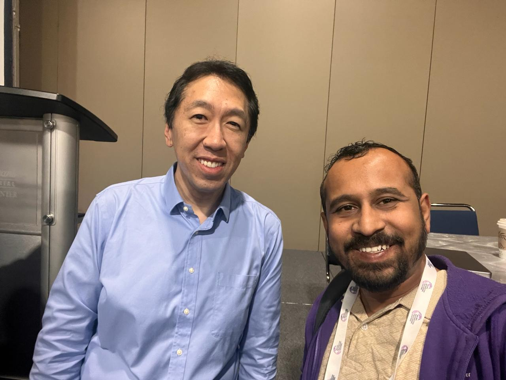
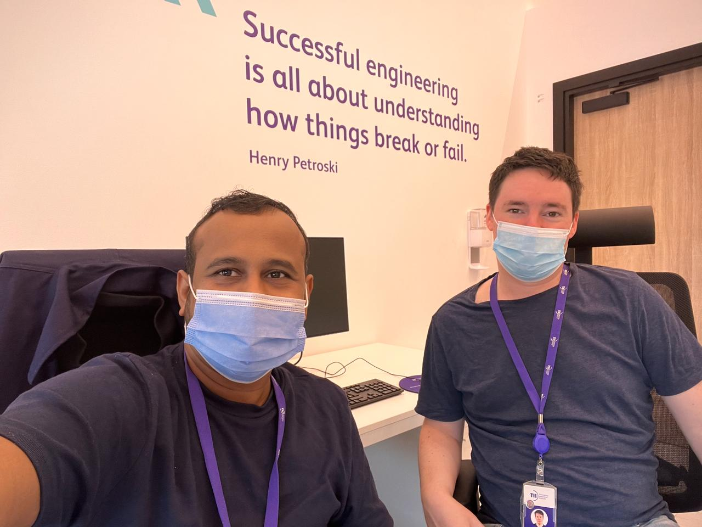

## 
I truly believe that our accomplishments are largely influenced by those who inspire us. Some moments have to be truly cherished as we will remember them forever. Here are some of those  cherished moments for me:

* [Here is a picture with my supervisor, Prof. Rajat Subhra Chakraborty, after my PhD defense. Apologies for the low image quality. ] 
 

* [A picture with the team from SEAL (Secured Embedded Architecture Lab) after winning second prize in CSAW Embedded Security Competetion 2017 in IIT Kanpur ] 

 

* [A picture with the Prof. Debdeep Mukhopadhyay Sir at NYU, Abu dhabi ] 
  

* [A picture with the Prof. Adi Shamir at TII, Abu dhabi ] 

  

* [A picture with the Prof. Andrew NG  at NeurIPS 2023, New Orleans, USA ]
 
  

* [A picture with the Jeroen Devaulx  at TII, Abu dhabi ]
 
  

  